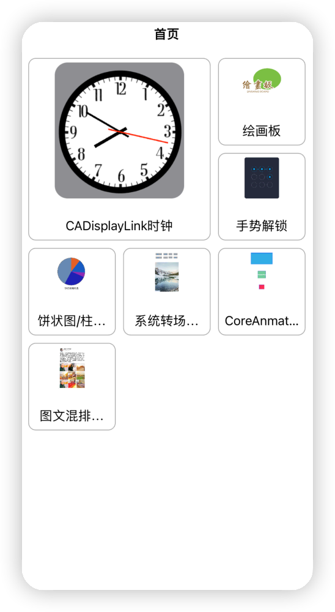
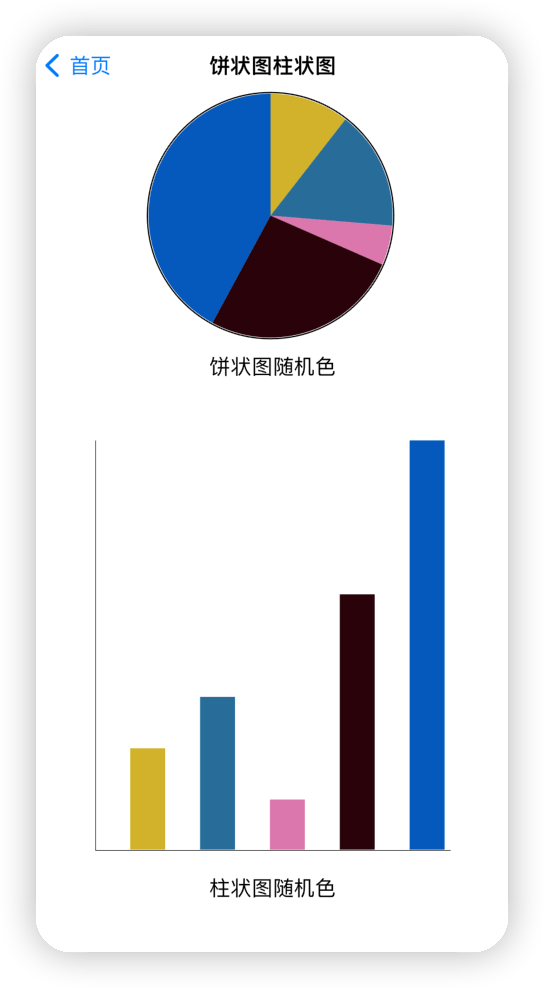

# 这个项目主要用做日常Demo验证

#### Demo1 实现collectionView 自定义Layout 实现自己计算item frame 排版位置。如下图：

#### Demo2  使用贝塞尔曲线实现  绘画板 并使用Socket 同步绘画板

<figure>

</figure>

#### Demo3 使用贝塞尔曲线 画出饼状图 柱状图

#### Demo4  实现 手势解锁

#### Demo 5 实现 仿微信朋友圈-图文混排，自定义转场动画，图片浏览器

#### Demo6 使用CGAffineTransform动画 和CADisplayLink 实现 时钟动画

